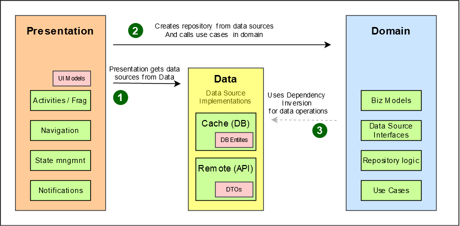

# Welcome to Weather Application!

It's an app built using the MVI, Repository Pattern and Clean Architecture on top of feature modules. It uses the [Weather API]( https://api.worldweatheronline.com/premium/v1/weather.ashx?key=b17430f61a27465ea77192310221304&q=Aqaba%2C%20Jordan&format=json) and displays weather details for specific city.

## Index

- [Key Features](#key-features)
- [Architecture](#architecture)
- [Modules](#modules)
- [Libraries](#libraries)

## Key Features
1. **Separation of Concerns:** The app is built using Uncle Bob's clean architecture (see architecture section below)
3. **Navigation logic** Modules navigation is being handled in navigation module. All UI components are responsible for their own navigation based on the events known to them.
4. **Architecture** We are using clean architecture on top of feature modules in this application.

## Architecture
The app is built with scalability in mind. To maintain the separation of concerns, [Clean Architecture](https://blog.cleancoder.com/uncle-bob/2012/08/13/the-clean-architecture.html) by Robert C. Martin, is used. The diagram below shows how the clean architecture is mapped to this android application 

## Modules
To make this app highly scale-able every feature is separated out in a new module.

### App Module
App module is connecting all the modules using di module, It have activities and control of flow between modules.

### DI Module
DI module contains dependency injection logic for all the application.

### Features
Features Directory have all relevant feature modules, to navigate to a feature navigation module is used. All features are using shared modules to use common components.

### Shared Modules
Core, data, navigation modules are being shared to all feature modules to reuse components and data.

### Flow of control:
Flow of control is one directional only. Any inner layer doesn't know about any layer outside of it. If an inner layer needs to communicate to an outer layer, it is done via Dependency Inversion. 

To maintain this separation over the course of time, separate android/kotlin modules have been used for each layer.

### Domain

This is a pure Kotlin logic. As such, it is platform independent and can be reused anywhere (Web, iOS, Desktop etc). It contains:

- **Business Models** - POKOs
- **Data Source Interfaces** - This definition of data sources allows the app to substitute the DB or remote implementations any time without breaking the logic.
- **Repositories** - Repository definitions and implementations both are a part of Domain. No matter how the data sources are implemented (db, in memory, in-file), Repository has the business logic to choose the right data source for returning the data.
- **Use Cases** - These represent the user interactions with the system and contain business logic.

Note: Domain is totally unaware about the rest of the system.

### Data

Data contains persistent and remote data source implementations. It implements all the data source interfaces provided by the domain module. 

The data module has separate data models for each data source. It is the responsibility of data module to transform this data to business model before returning it back. This ensures that actual implementation of the data sources can be changed any time without affecting the rest of the system.

Currently, the data module uses Room and Retrofit which are platform dependent. However, by using SQLDelight and Ktor, this module can also be made platform independent.

### UI
It contains all the platform specific, i.e. Android, code. It is responsible for User Interface and handling user actions. 

Presentation module is dependent on both domain and data modules. Presentation module has its own UI models but when triggering a use case, presentation module will always use business model objects.

It is the job of presentation module to provide the data module implementations to domain module for business logic execution.

## Libraries

- **Material Design** - UI design
- **AndroidX** - ViewModel, LiveData
- **KotlinX** - Coroutines, Flow, StateFlow, Serialization
- **Hilt** -  Dependency Injection
- **Navigation Component** - User navigation
- **Glide** - Loading Images
- **Room** - Database Storage
- **Retrofit** - API Calls

